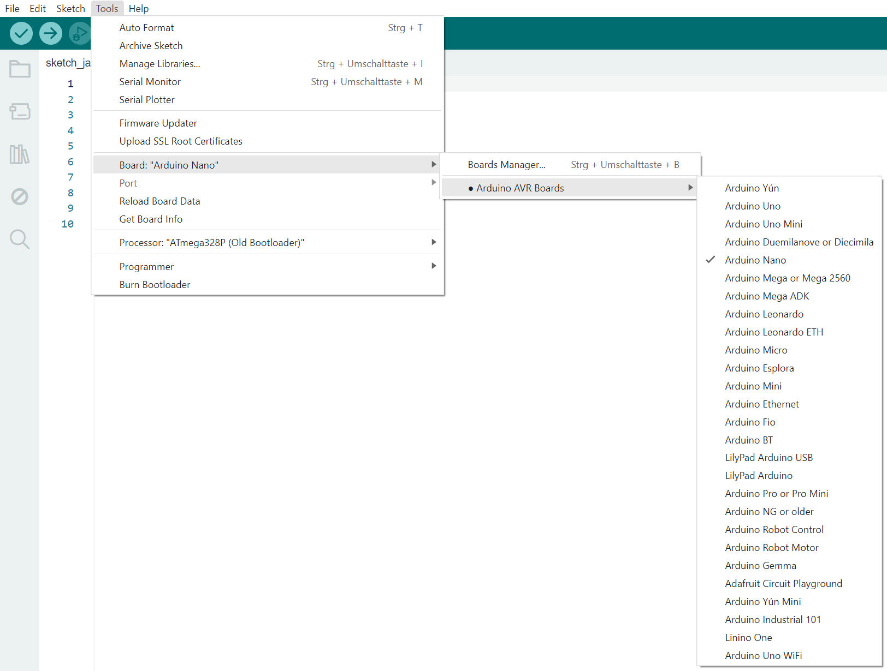
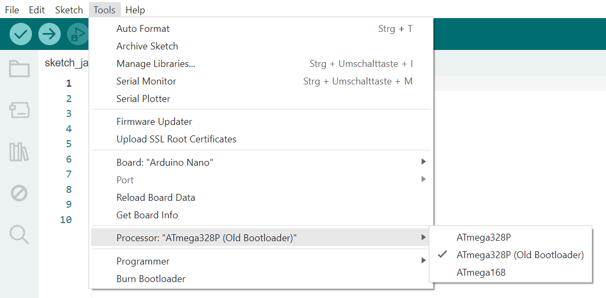

# KeplerFischBRAIN

KeplerFischBRAIN wird in der Arduino IDE programmiert.  
Die Arduino IDE (Integrated Development Environment) ist eine Open-Source-Plattform, die zum Schreiben und Hochladen von Programmen auf Arduino-kompatible Boards verwendet wird.

### rename File
Um das Programm auszuführen, müssen die Datei des Programms `programm_name.ino` und die Datei `KeplerFischBrain.h` zusammen in einem lokalen Ordner gespeichert werden, der den Namen des Programms trägt, z.B. `programm_name`.

### Choose Microcontroller
KeplerFischBRAIN verwendet einen Arduino Nano als Mikrocontroller. Dieser muss in der Arduino IDE ausgewählt werden.

### Set Bootloader
Zusätzlich muss als Prozessor der `ATmega328P (Old Bootloader)` ausgewählt werden. ACHTUNG! Manchmal funktioniert nur `ATmega328P`.
