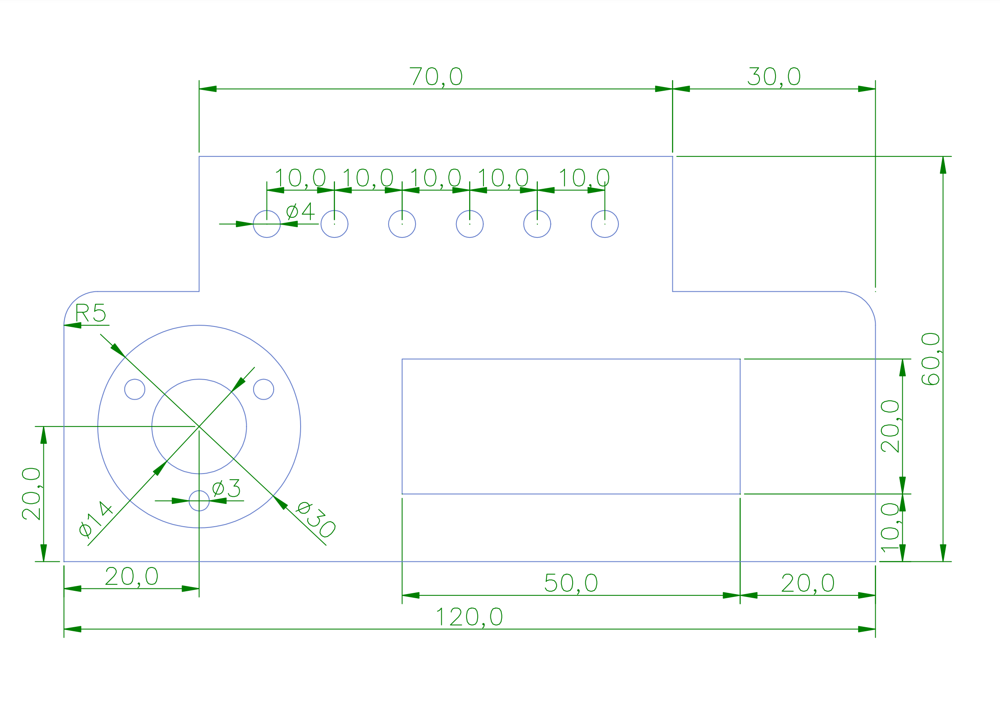

# LiteCAD Aufgaben

### Recherchiere im Internet und beantworte die folgenden Fragen: 

- Wofür steht die Abkürzung CAD? (1 Pkt)

            CAD(von englisch computer-aided design) zu Deutsch Rechnerunterstütztes Konstruieren

- Gib fünf Anwendungsbereiche an, in denen 2D CAD Konstruktions-Software eingesetzt wird und eine große Rolle spielt! (5 Pkt)

            MAschinenbau, Architektur, Elektrotechnik, Innenarchitektur, Automobilindustrie, Luft- und Raumfahrt, Produktentwicklung, usw.

- Nenne mindestens drei der am häufigsten verwendeten 2D CAD Konstruktions-Programme aus Industrie und Wirtschaft! (3 Pkt)

            AutoCAD, SOLIDWORKS, SketchUP

- Mit welchem Dateiformat können 2D Konstruktionen zwischen Anwendungen unterschiedlicher Hersteller ausgetauscht werden, von welcher Firma wurde dieses Dateiformat entwickelt und festgelegt? (2 Pkt)

            DXF-Datein werden am häufigsten verwendet. DXF steht für "Drawing Exchange Format"

## [Aufgabe 1 Seitenplatte](./Aufgabe_1.lcd)

Erstelle eine 2D Konstruktion zur Dimensionierung eines Rohres. Die Konstruktionselemente sollen dazu auf drei Layern angeordnet werden.  
Die Layer sollen (anders als in der Abbildung dargestellt!) unterschiedliche Farben haben.  

- Layer 1: Umriss außen 
- Layer 2: Bohrungen (kleinen Kreise) 
- Layer 3: Tasche (die beiden größeren Kreise) 
- Layer 4: Rechteck innen 
- Layer 5: Maßangaben

